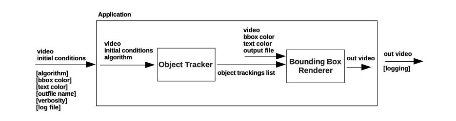

# Object Tracker

Application for multi object tracking, given initial bounding boxes. The application receives a video and the initial bounding boxes as input and generates an output video with the object trackings.
**OpenCV** is used as source for the tracking algorithms and frame editions.


# Table of Contents
1. [Requirements](#requirements)
2. [Installation](#installation)
3. [Usage](#usage)
4. [Tests](#tests)
5. [Application Design Basics](#design)
6. [Project Directory Structure](#structure)
7. [References](#reference)

## Requirements  <a name="requirements"></a>

This application requieres the following for its installation and usage:

* [git][git] 
* [Docker][docker]


[git]: https://git-scm.com/
[docker]: https://www.docker.com/   

## Installation <a name="installation"></a>

Download the source repository to the desired location. From now on this directory will be refered to as $REPO_BASE_DIR: 

```bash
cd $REPO_BASE_DIR
git clone git@github.com:alejandroviegener/ObjectTracker.git
```

The application is dockerized, to build the Docker image follow these steps:

1) Change to the source directory in the repository and give permission to the installation script:

```bash
cd source
chmod +x install.sh
```

2) Execute the install script:

```bash
./install.sh
```

The script will create a docker image and an **in_out** directory. This directory will be used as in and out entrypoint for the aplication. 

To confirm the creation of the image, execute:

```bash
docker image ls
```

A docker image named "deepvision-tracker" must be listed

## Usage <a name="usage"></a>

Change to the source directory in the repository:

```bash
cd $REPO_BASE_DIR/source
```

Give permissions to the application script:

```bash
chmod +x tracker.sh
```

Run the application help:

```bash
./tracker.sh --help

usage: tracker [-h] [-a {KCF,MOSSE,CSRT}] [-t TEXT_COLOR TEXT_COLOR TEXT_COLOR] [-b BOX_COLOR BOX_COLOR BOX_COLOR] [-o OUT_FILE_NAME] [-v {0,1,2,3}] [-l] video initial_conditions

positional arguments:
  video                 Input video file
  initial_conditions    Initial conditions (json) file

optional arguments:
  -h, --help            show this help message and exit
  -a {KCF,MOSSE,CSRT}, --algorithm {KCF,MOSSE,CSRT}
                        Tracking algorithm (default: CSRT)
  -t TEXT_COLOR TEXT_COLOR TEXT_COLOR, --text_color TEXT_COLOR TEXT_COLOR TEXT_COLOR
                        Text color, BGR separated by space (default: [255, 255, 255])
  -b BOX_COLOR BOX_COLOR BOX_COLOR, --box_color BOX_COLOR BOX_COLOR BOX_COLOR
                        Box color, BGR separated by space (default: [0, 255, 0])
  -o OUT_FILE_NAME, --out_file_name OUT_FILE_NAME
  -v {0,1,2,3}, --verbosity {0,1,2,3}
                        Set output verbosity (0- Error, 1 - Warning, 2 - Info, 3 - Debug) (default: 2)
  -l, --log             Log to file (default: False)
```

Typical usage:

1) Copy the input video and initial conditions to the **in_out** directory

2) Execute the tracker application

```bash
./tracker.sh input.mkv initial_conditions.json -a CSRT -b 0 255 0 -t 255 255 255 -o out_file_name -v 2 --log
```

**Note**: The input video file, the initial conditions file and the output of the application, i.e. video and log file, are managed trough the **in_out** directory.

## Tests <a name="tests"></a>

To run the tests for the tracker package, execute the tracker script with the **--test** option:

```bash
./tracker.sh --test
```

## Application Design Basics <a name="design"></a>

The following diagramm shows the basic design and flow of the application implementation:




1) An **input video** and an **initial condition** file defining the initial bounding boxes is passed to the application as parameters. Optional parameters are the bounding box color, the description text color, output file name, verbosity level and output logging enabled/disabled. The input parameters are parsed using the **argparse** python lib. 
2) The **Object Tracker** block tracks the objects specified in the initial bounding boxes trough the input video frames. The tracker outputs a list of dictionaries that contains the tracking information for every object. This information inclues: the object id, the track status, and the bounding box coordinates. The tracker is implemented in the **ObjectTracker** class in the **object_tracker** module of the **tracker** package. The tracker enables to use 3 different tracking algorithms, i.e., KCF, MOSSE and CSRT. The library **OpenCV** was used. In particular, for the input video given in this challenge, CSRT performs best but is also the slowest algorithm. MOSSE and KCF are faster but loose the tracking in some frames of the video.
3) The objects tracking list and the input video are passed as input parameters to the **Bounding Box Renderer** block. The renderer generates a new video by combining the input video and the result of the tracker. The renderer also accepts as paramaters the bounding box and text formatting options. The renderer is implemented in the **BoundingBoxRenderer** class in the **renderer** module of the **tracker** package. The library **OpenCV** was used.
4) The application outputs the rendered output video with the bounding boxes and information text, and also outputs the log messages to console and file if enabled. The console/file output logs are managed in the tracker package by the **logging** python lib. A hiererchal logging is implemented, a root logger for the package, and child loggers for the different modules in the package. 


## Project Directory Structure <a name="structure"></a>

Structure and description of the most important dirs and files in the project

```bash
ObjectTracker
    │
    ├── data: dir containing the developments assests of the challenge
    │   ├── initial_conditions.json
    │   └── input.mkv
    ├── documents: dir containing project documentation
    │   └── Challenge Computer Vision & Python Engineer - Deep Vision AI.pdf
    ├── research: dir containing notebooks and scripts generated in the initial research stage of the project
    │   ├── notebooks
    │   │   └── 01_opencv-basics.ipynb
    │   └── scripts
    │       ├── 01_opencv-tracker-test.py
    │       └── 02_opencv-multi-tracker-test.py
    └── source: dir containing the application and packages source code
        ├── Dockerfile: docker file for the application
        ├── install.sh: script to install the application
        ├── requirements.txt: python requirements file
        ├── test.sh: script to execute the module tests
        ├── tracker: tracker package
        │   ├── __init__.py
        │   ├── conftest.py
        │   ├── multi_tracker.py
        │   ├── object_tracker.py
        │   ├── renderer.py
        │   ├── root_logger.py
        │   ├── tests: dir containing the tests for this package
        │   ├── types.py
        │   └── utils.py
        ├── tracker.py: python tracker application script
        └── tracker.sh: script to launch application/tests

```

## References <a name="reference"></a>

* https://www.learnopencv.com/object-tracking-using-opencv-cpp-python/
* https://www.pyimagesearch.com/2018/08/06/tracking-multiple-objects-with-opencv/
* https://docs.docker.com/develop/develop-images/dockerfile_best-practices/
* https://www.udemy.com/course/python-for-computer-vision-with-opencv-and-deep-learning/
* https://www.udemy.com/course/docker-and-kubernetes-the-complete-guide/
  